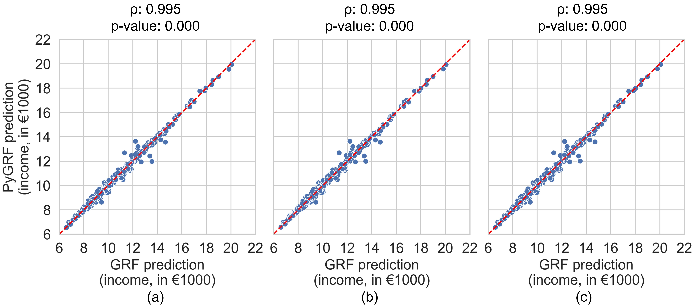
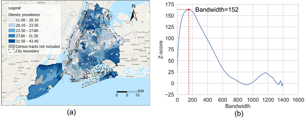
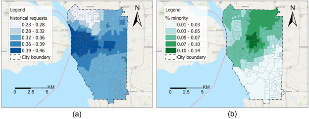

# PyGRF: An improved Python Geographical Random Forest model and case studies in public health and natural disasters

### Overall description
Geographical random forest (GRF) is a recently developed and spatially explicit machine learning model. With the ability to provide more accurate predictions and local interpretations, GRF has already been used in many studies. The current GRF model, however, has limitations in its determination of the local model weight and bandwidth hyperparameters, potentially insufficient numbers of local training samples, and sometimes high local prediction errors. Also, implemented as an R package, GRF currently does not have a Python version which limits its adoption among machine learning practitioners who prefer Python. This work addresses these limitations by introducing theory-informed hyperparameter determination, local training sample expansion, and spatially-weighted local prediction. We also develop a Python-based GRF model and package, PyGRF, to facilitate the use of the model. We evaluate the performance of PyGRF on an example dataset and further demonstrate its use in two case studies in public health and natural disasters.

This repository contains the source code and parameter descriptions of the PyGRF model, and three Jupyter Notebooks and related datasets for income prediction and two case studies.


<br />
<br />

<p align="center">

<br />
Figure 1. Scatter plots for predictions of PyGRF and GRF in three different settings: (a) 50 trees; (b) 75 trees; (c) 100 trees.
</p>

<br />
<br />
<p align="center">

<br />
Figure 2. Neighborhood-level obesity prevalence in NYC and incremental spatial autocorrelation of the data: (a) a map visualization of obesity prevalence; (b) incremental spatial autocorrelation test result.
</p>
<br />

<br />
<p align="center">

<br />
Figure 3. Map visualizations for the local feature importance of two variables: (a) % Black; (b) median household income.
</p>
<br />


### Repository organization

* The file "PyGRF.py" is the source code of this Python-based GRF model.
* The file "Description_Parameters.pdf" explains the details of parameters in this model.
* The folder "Notebooks" contains three Jupyter Notebooks used for implementing income prediction and two case studies in public health and natural disasters.
* The folder "Data" contains the income dataset and experimental data for two case studies including obesity rate data and 311 help request data.
* The folder "Test" contains the Python file for the unit test for the PyGRF package. The Pytest package is needed to run this file.
<br />


### Installation

We have published PyGRF as a Python package in [PyPI](https://pypi.org/project/PyGRF/). You can directly install it with the command "pip install PyGRF". 
<br />
<br />


### Potential issues and solutions

* PyGRF requires the pacakge esda as a dependency for computing Moran's Index. We recommend users to install esda 2.5, and then PyGRF can be used smoothly with any additional action. If you use the latest version of esda 2.6, you will need to install matplotlib manually in order to import PyGRF successfully.   


### Example

Below shows an example on how to fit a PyGRF model and use it to make predictions.

```python
from PyGRF import PyGRF
from sklearn.model_selection import train_test_split

# Split your data into training and test sets
X_train, X_test, y_train, y_test = train_test_split(X, y, random_state=42)

#Create a PyGRF model by specifying hyperparameters
pygrf_example = PyGRF.PyGRFBuilder(n_estimators=60, max_features=1, band_width=39, train_weighted=True, predict_weighted=True, bootstrap=False,
                          resampled=True, random_state=42)

#Fit the created PyGRF model based on training data and their spatial coordinates
# xy_coord is the two-dimensional coordinates of training samples						  
pygrf_example.fit(X_train, y_train, xy_coord)

#Make predictions for testing data using the fitted PyGRF model and you specified local model weight 
predict_combined, predict_global, predict_local = pygrf_example.predict(X_test, coords_test, local_weight=0.46)
```
<br />


### Parameters
If you want to learn more about the major parameters in this package, please refer to the [Description of Parameters](https://github.com/geoai-lab/PyGRF/blob/master/Description_Parameters.pdf).
<br />
<br />


## Authors
* **Kai Sun** - *GeoAI Lab* - Email: ksun4@buffalo.edu
* **Yingjie Hu** - *GeoAI Lab* - Email: yhu42@buffalo.edu


## Reference
If you use the data or code from this repository, or the PyGRF package, we will really appreciate if you can cite our paper:

Kai Sun, Ryan Zhenqi Zhou, Jiyeon Kim, and Yingjie Hu (2024): PyGRF: An improved Python Geographical Random Forest model and case studies in public health and natural disasters. Transactions in GIS, 28(7), 2476-2491.

## Acknowledgement

This work is supported by the U.S. National Science Foundation under Grant Nos. BCS-2117771 and BCS-2416886. Any opinions, findings, and conclusions or recommendations expressed in this material are those of the authors and do not necessarily reflect the views of the National Science Foundation.


