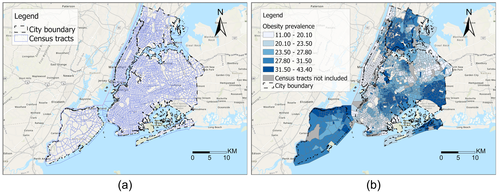
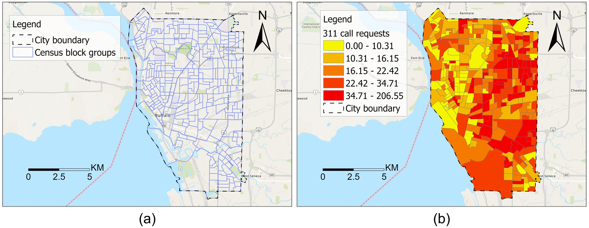

# PyGRF: An improved Python Geographical Random Forest model and case studies in public health and natural disasters

### Overall description
Geographical random forest (GRF) is a recently developed and spatially explicit machine learning model. With the ability to provide more accurate predictions and local interpretations, GRF has already been used in many studies. Implemented as an R package, GRF currently does not have a Python version which limits its adoption among machine learning practitioners. The current GRF model also has limitations in the determination of the local model weight and bandwidth parameters, potential insufficient numbers of local training samples, and sometimes high local prediction errors. In this work, we develop a Python-based GRF model, PyGRF, and conduct assessment to ensure its consistency with the original R-based model. We further address the three limitations by introducing theory-informed local model weight and bandwidth determination, local training sample expansion, and spatially-weighted local predictions. We demonstrate the performance of PyGRF and use it in two case studies in public health and natural disasters.

This repository contains two Jupyter Notebooks and related datasets for the two case studies.

 
 

 
Figure 1. Scatter plots for predictions of PyGRF and GRF in three different settings: (a) 50 trees; (b) 75 trees; (c) 100 trees.

 
 

 
Figure 2. Map visualizations for the case study of obesity prevalence estimation in NYC: (a) city boundary of NYC and its census tracts; (b) obesity prevalence in NYC in 2018.

 

 

 
Figure 3. Map visualizations for the case study of help request prediction in Buffalo: (a) city boundary of Buffalo and its census block groups; (b) help requests in Buffalo during the period from 12/19/2022 to 1/1/2023.

 

### Repository organization

* The folder "Notebooks" contains two Jupyter Notebooks used for implementing the two case studies in public health and natural disasters.
* The folder "Data" contains the experimental data for the two case studies including obesity rate data and 311 help request data.
 

### Installation

We have published the code for PyGRF as a Python package in PyPI (https://pypi.org/project/PyGRF/). You can directly install it with the command "pip install PyGRF". 
 
 

### Reference
If you use the data or code from this repository, or the PyGRF package, we will really appreciate if you can cite our book chapter:

Kai Sun, Ryan Zhenqi Zhou, Jiyeon Kim, and Yingjie Hu. 2024. PyGRF: An improved Python Geographical Random Forest model and case studies in public health and natural disasters.

